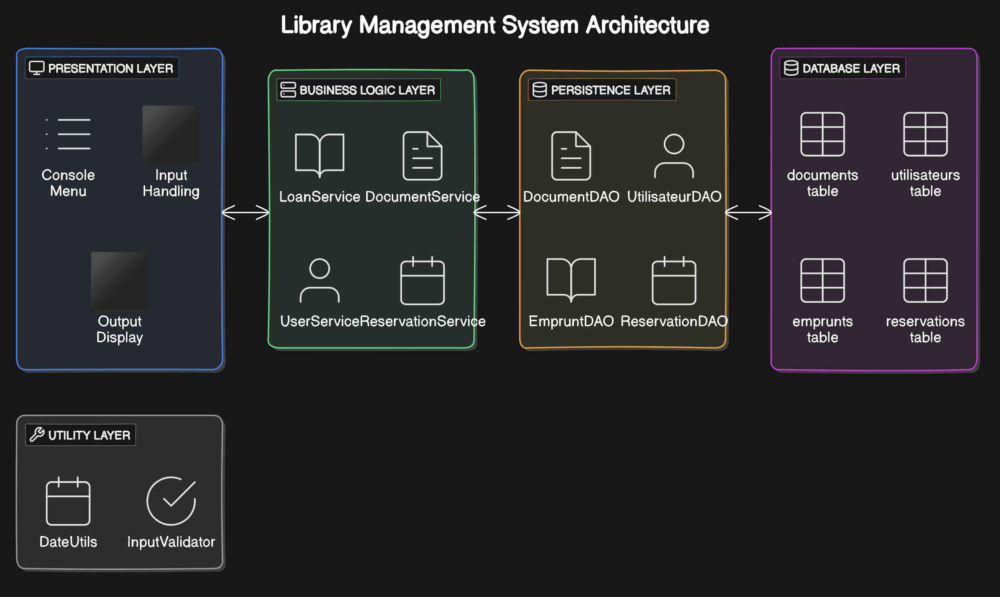
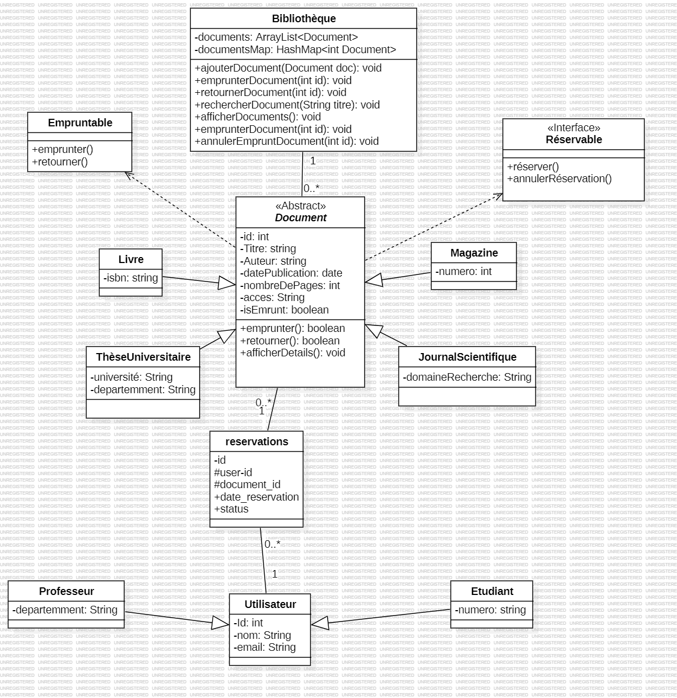
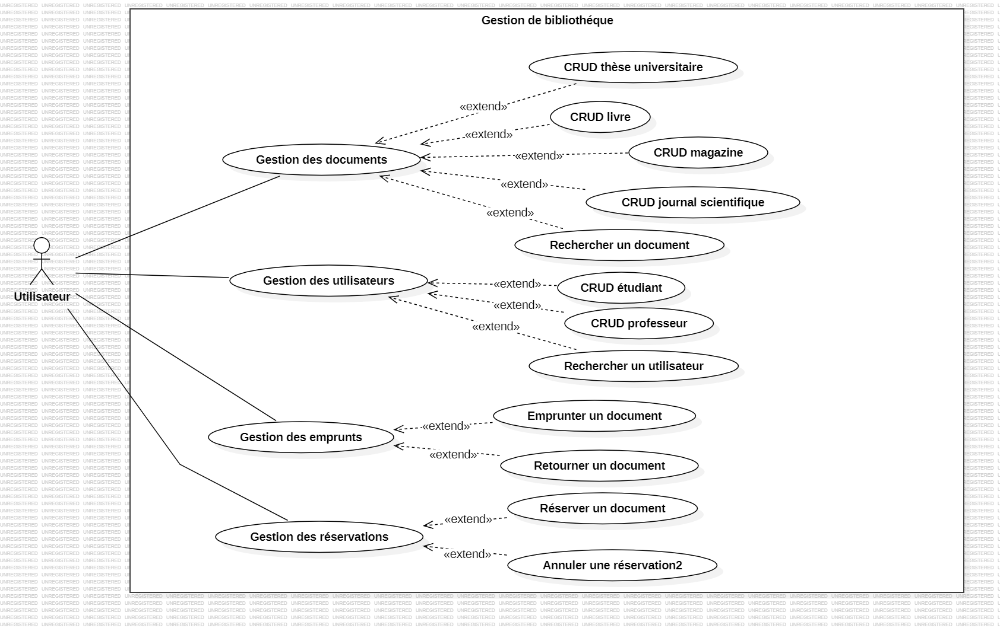

# Library Management System - Version 2

## Project Overview
This project is an advanced console-based library management system built in Java. The system evolves from a previous version by introducing data persistence with PostgreSQL, an improved object-oriented structure, and more advanced features. The main goal is to enhance functionality while focusing on Java best practices such as polymorphism, inheritance, and using design patterns.
## Project Design
Below is the system design structure of the project:


## Learning Objectives
- Deepen understanding of Object-Oriented Programming (OOP) concepts in Java, particularly polymorphism and inheritance.
- Design and implement a simple relational database using PostgreSQL.
- Apply software design principles and implement UML diagrams.
- Utilize project management tools like Git and JIRA effectively.

## Application Structure

### Presentation Layer
- **Console UI**: An enhanced console-based interface for interacting with the system. The menu structure is customizable.

### Business Logic Layer
- **Document Hierarchy**:
    - **Abstract Class**: `Document`
    - **Subclasses**:
        - `Livre`
        - `Magazine`
        - `JournalScientifique` (Attributes: domainResearch)
        - `ThèseUniversitaire` (Attributes: university, domain)

- **User Hierarchy**:
    - **Abstract Class**: `Utilisateur`
    - **Subclasses**:
        - `Etudiant` (Additional attributes and methods)
        - `Professeur` (Additional attributes and methods)

### Persistence Layer
- **DAO (Data Access Objects)**: For database access, following the DAO design pattern to handle CRUD operations on documents and users.

### Utility Layer
- **DateUtils**: Advanced date manipulation utility class.
- **InputValidator**: Enhanced user input validation class.

## Features

### Document Management
- Create, Read, Update, and Delete (CRUD) for all document types.
- Advanced search functionality.

### User Management
- CRUD operations for both `Etudiant` and `Professeur` user types.
- Manage borrowing rights based on user type.

### Loan Management
- Borrow and return documents.

### Reservation Management
- Reserve and cancel document reservations.

## Technical Specifications

### Java 8
- **Reference Methods** and **Optional** types for handling null values.
- **Java Time API** for advanced date handling.
- **Stream API** for processing collections.
- **Functional Interfaces** and **Lambda Expressions** to enhance code readability and efficiency.

### Database
- **PostgreSQL**: Used as the RDBMS for its superior support for table inheritance.
    - Design a relational schema using PostgreSQL.
    - Use JDBC for connecting and performing database operations.
    - Implement PostgreSQL-specific SQL queries.

### Data Collections and Optimization
- **Collection API** and **HashMaps**: Optimized document search using `HashMap`.

### Memory Management
- Use **Garbage Collection** effectively for memory management, especially for database resource handling.
- **Try-with-resources** pattern for managing PostgreSQL connections.
- Ensure all connections in the DAO layer are explicitly closed after each operation.

## Design Patterns
- **DAO Pattern** for database access.
- **Singleton Pattern** to manage application-wide resources.
- **Polymorphism**: Utilized effectively in the class hierarchy.

## Project Management
- Continued use of **Git** with an advanced branching strategy.
- **JIRA** for task management:
    - Single sprint with a backlog.
    - User stories mapped to specific tasks.

## UML Diagrams
- **Use Case Diagram**: Created for the main features of the system.
- **Class Diagram**: Updated to reflect the new class structure.

## Setup and Installation

### Prerequisites
- **Java 8**: Ensure you have JDK 8 installed.
- **PostgreSQL**: Install PostgreSQL and set up the required database schema.
- **JDBC Driver**: Ensure the PostgreSQL JDBC driver is included in your project dependencies.

# Conception UML
## Diagramme de cas d'utilisation :

## Diagramme de classe :



### Steps to Run the Project
1. Clone the repository:
   ```bash
   git clone https://github.com/username/LibraryManagementSystemV2.git
   cd LibraryManagementSystemV2


Pour exécuter l'application, exécutez la commande suivante :
```bash
cd out/artifacts/Bibliothequev2_jar
   ```
   ```bash
     java -jar Bibliothequev2.jar
    ```

```
## Link plan jira
https://cinemy.atlassian.net/jira/software/projects/BB/boards/6/backlog?selectedIssue=BB-2